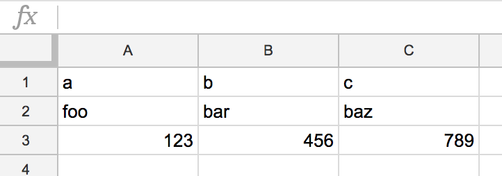

terminal-gsheet-viewer
================
Print table-based data on spreadsheet to terminal with simple file cache



```
$ python ./terminal_gsheet_viewer.py <spreadsheet_key> <worksheet_gid>

+-----+-----+-----+
| a   | b   | c   |
+-----+-----+-----+
| foo | bar | baz |
| 123 | 456 | 789 |
+-----+-----+-----+
```

## Install

- `pip install pygsheets terminaltables`
- [Put your downloaded `client_secret.json`](https://cloud.google.com/genomics/downloading-credentials-for-api-access) in project dir

## Usage

```bash
$ python ./terminal_gsheet_viewer.py <spreadsheet_key> <worksheet_gid> [<use_cache? 1 or 0>=0]
```

### clear cache

```bash
$ rm ./cache/*
```

## LICENSE
MIT